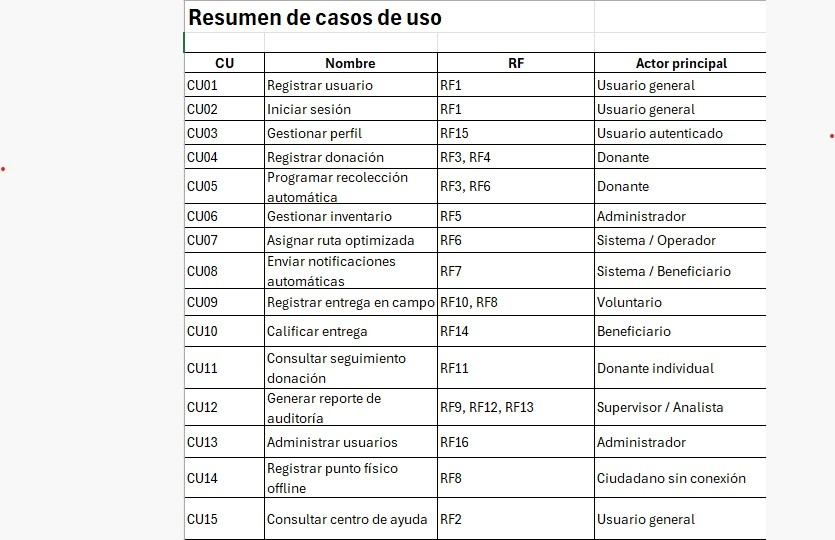

## Casos De Usos:

## CU01 — Registrar usuario

Actor(es): Usuario general (cualquier rol)
Precondiciones:

El usuario no está registrado en el sistema.
El correo electrónico no existe previamente en la base de datos.

Flujo normal:

Paso 1: El usuario accede al formulario de registro.
Paso 2: El sistema muestra los campos: nombre, apellido, correo, contraseña, teléfono, dirección y rol.
Paso 3: El usuario completa todos los campos y confirma.
Paso 4: El sistema valida que el correo no esté duplicado y que todos los campos requeridos estén completos.
Paso 5: El sistema cifra la contraseña con SHA-256.
Paso 6: El sistema almacena el registro en la tabla USUARIO con estado activo.
Paso 7: El sistema confirma el registro exitoso y redirige al inicio de sesión.

Flujos alternativos:

FA1: Si el correo ya existe, el sistema muestra "El correo ya está registrado" y no crea el usuario.
FA2: Si algún campo obligatorio está vacío, el sistema resalta el campo y no permite continuar.
FA3: Si la contraseña no cumple el formato mínimo, el sistema solicita una más segura.

Postcondiciones:

El usuario queda registrado en la tabla USUARIO con su rol asignado y estado activo.
El registro queda guardado en la tabla LOG.

RF asociado: RF1

## CU02 — Iniciar sesión

Actor(es): Usuario general (cualquier rol)
Precondiciones:

El usuario está registrado en el sistema.
La cuenta está activa.

Flujo normal:

Paso 1: El usuario accede al formulario de inicio de sesión.
Paso 2: El usuario ingresa su correo y contraseña.
Paso 3: El sistema busca el correo en la tabla USUARIO.
Paso 4: El sistema compara la contraseña ingresada (cifrada con SHA-256) con la almacenada.
Paso 5: El sistema verifica que el estado de la cuenta sea activo.
Paso 6: El sistema crea la sesión del usuario y lo redirige al panel correspondiente a su rol.

Flujos alternativos:

FA1: Si el correo no existe, el sistema muestra "Credenciales incorrectas" sin especificar cuál campo falló.
FA2: Si la contraseña no coincide, el sistema muestra el mismo mensaje genérico.
FA3: Si la cuenta está inactiva, el sistema muestra "Cuenta desactivada. Contacte al administrador."

Postcondiciones:

El usuario tiene una sesión activa con acceso únicamente a las funciones permitidas por su rol.

RF asociado: RF1

## CU03 — Gestionar perfil de usuario

Actor(es): Usuario autenticado (cualquier rol)
Precondiciones:

El usuario ha iniciado sesión.

Flujo normal:

Paso 1: El usuario accede a la sección "Mi perfil".
Paso 2: El sistema muestra los datos actuales: nombre, apellido, correo y contraseña enmascarada.
Paso 3: El usuario modifica los campos que desea actualizar.
Paso 4: El sistema valida que el correo no esté en uso por otro usuario.
Paso 5: Si se cambia la contraseña, el sistema la cifra con SHA-256 antes de guardar.
Paso 6: El sistema actualiza el registro en la tabla USUARIO.
Paso 7: El sistema muestra confirmación de actualización exitosa.

Flujos alternativos:

FA1: Si el nuevo correo ya pertenece a otro usuario, el sistema muestra error y no guarda.
FA2: Si la nueva contraseña no cumple el formato mínimo, el sistema la rechaza.

Postcondiciones:

Los datos del usuario quedan actualizados en la tabla USUARIO.
El cambio queda registrado en la tabla LOG.

RF asociado: RF15

## CU04 — Registrar donación

Actor(es): Donante (supermercado, restaurante, particular)
Precondiciones:

El donante ha iniciado sesión.
El donante tiene al menos un producto para donar.

Flujo normal:

Paso 1: El donante accede a la sección "Nueva donación".
Paso 2: El sistema muestra el formulario con campos: tipo de donación, observaciones y fecha de recolección.
Paso 3: El donante agrega los productos indicando nombre, categoría, cantidad, unidad de medida y fecha de vencimiento.
Paso 4: El donante confirma el envío del formulario.
Paso 5: El sistema valida que la fecha de recolección sea futura y que los productos no estén vencidos.
Paso 6: El sistema registra la donación en la tabla DONACION con estado "pendiente".
Paso 7: El sistema registra cada producto en la tabla PRODUCTO vinculado a la donación.
Paso 8: El sistema notifica automáticamente al operador logístico sobre la nueva recolección pendiente.
Paso 9: El sistema confirma al donante el registro exitoso.

Flujos alternativos:

FA1: Si algún producto tiene fecha de vencimiento pasada, el sistema lo rechaza y lo indica.
FA2: Si la fecha de recolección es inválida, el sistema solicita corrección.
FA3: Si el donante es un restaurante, el sistema exige subir evidencia digital (foto o firma).

Postcondiciones:

La donación queda registrada en DONACION con estado "pendiente".
Los productos quedan en PRODUCTO vinculados a la donación.
Se genera una recolección programada en RECOLECCION.
El registro queda en LOG.

RF asociado: RF3, RF4

## CU05 — Programar recolección automática

Actor(es): Donante (supermercado), Sistema
Precondiciones:

El donante ha iniciado sesión.
Existe al menos una donación registrada con estado "pendiente".
El sistema tiene operadores logísticos disponibles.

Flujo normal:

Paso 1: El donante accede a "Programar recolección automática".
Paso 2: El sistema muestra los productos próximos a vencer registrados por el donante.
Paso 3: El donante selecciona los productos y confirma la programación.
Paso 4: El sistema evalúa la proximidad de vencimiento y la disponibilidad de transporte.
Paso 5: El sistema genera automáticamente una recolección en la tabla RECOLECCION con fecha y operador asignado.
Paso 6: El sistema genera la ruta optimizada usando el algoritmo de Dijkstra y la guarda en RUTA.
Paso 7: El sistema notifica al operador logístico con la ruta y detalles de la recolección.
Paso 8: El sistema confirma al donante la recolección programada.

Flujos alternativos:

FA1: Si no hay operadores disponibles, el sistema notifica al administrador y deja la recolección en estado "pendiente de asignación".
FA2: Si el producto ya venció antes de la recolección programada, el sistema cancela y notifica al donante.

Postcondiciones:

La recolección queda registrada en RECOLECCION con operador y ruta asignados.
La ruta queda en RUTA con el algoritmo Dijkstra aplicado.
El operador recibe notificación en NOTIFICACION.

RF asociado: RF3, RF6

## CU06 — Gestionar inventario

Actor(es): Administrador del Banco de Alimentos
Precondiciones:

El administrador ha iniciado sesión.
Existen donaciones recolectadas con productos en el sistema.

Flujo normal:

Paso 1: El administrador accede al panel de inventario.
Paso 2: El sistema consulta la tabla INVENTARIO y muestra el stock actual con nombre, cantidad, categoría y fecha de vencimiento de cada producto.
Paso 3: El sistema resalta en color los productos que han alcanzado el umbral de alerta de caducidad.
Paso 4: El administrador revisa el estado del inventario y puede ajustar cantidades manualmente si es necesario.
Paso 5: El sistema actualiza el registro en INVENTARIO con la fecha de modificación.
Paso 6: El sistema genera una alerta automática para los productos próximos a vencer y la registra en NOTIFICACION.

Flujos alternativos:

FA1: Si un producto ya venció, el sistema lo marca como "vencido" y lo excluye de la distribución.
FA2: Si el stock de un producto llega a cero, el sistema cambia su estado a "agotado".

Postcondiciones:

El inventario queda actualizado en INVENTARIO.
Las alertas de caducidad quedan en NOTIFICACION.
Los ajustes manuales quedan en LOG.

RF asociado: RF5

## CU07 — Asignar ruta optimizada al operador

Actor(es): Sistema, Operador Logístico
Precondiciones:

Existen recolecciones o entregas programadas sin ruta asignada.
El operador logístico está activo en el sistema.

Flujo normal:

Paso 1: El sistema detecta una recolección o entrega pendiente sin ruta asignada.
Paso 2: El sistema obtiene las coordenadas de los puntos de origen y destino.
Paso 3: El sistema aplica el algoritmo de Dijkstra considerando distancia, prioridad de vencimiento y capacidad del vehículo.
Paso 4: El sistema genera la ruta óptima y la registra en la tabla RUTA.
Paso 5: El sistema asigna la ruta a la recolección o entrega correspondiente.
Paso 6: El sistema envía una notificación al operador con los detalles de la ruta: puntos, distancia y tiempo estimado.
Paso 7: El operador accede al sistema y confirma la recepción de la ruta.

Flujos alternativos:

FA1: Si la capacidad del vehículo es insuficiente para todos los productos, el sistema divide en múltiples rutas.
FA2: Si el operador no confirma en el tiempo establecido, el sistema notifica al administrador.

Postcondiciones:

La ruta queda registrada en RUTA y vinculada a la recolección o entrega.
El operador recibe notificación en NOTIFICACION.

RF asociado: RF6

## CU08 — Enviar notificaciones automáticas

Actor(es): Sistema, Beneficiario
Precondiciones:

Existen alimentos disponibles en el inventario.
Los beneficiarios están registrados y activos.
El servidor SMTP está configurado y operativo.

Flujo normal:

Paso 1: El sistema detecta un evento que requiere notificación (alimentos disponibles, alerta de caducidad, confirmación de entrega).
Paso 2: El sistema identifica los usuarios destinatarios según el tipo de evento.
Paso 3: El sistema genera el contenido del mensaje usando la plantilla HTML correspondiente.
Paso 4: El sistema envía el correo a través de smtplib.
Paso 5: El sistema registra la notificación en NOTIFICACION con estado "enviada".
Paso 6: El beneficiario recibe el correo con la información de disponibilidad y punto de entrega.

Flujos alternativos:

FA1: Si el envío falla, el sistema registra la notificación con estado "fallida" y reintenta automáticamente.
FA2: Si el beneficiario no tiene correo registrado, el sistema muestra la notificación en pantalla al iniciar sesión.

Postcondiciones:

La notificación queda registrada en NOTIFICACION con su estado final.

RF asociado: RF7

## CU09 — Registrar entrega en campo

Actor(es): Voluntario del Banco de Alimentos
Precondiciones:

El voluntario ha iniciado sesión desde cualquier dispositivo.
Existe una entrega asignada al voluntario con estado "pendiente".

Flujo normal:

Paso 1: El voluntario accede a la sección "Mis entregas pendientes".
Paso 2: El sistema muestra las entregas asignadas con beneficiario, productos y dirección.
Paso 3: El voluntario selecciona la entrega a registrar.
Paso 4: El voluntario sube la evidencia digital (foto o firma del beneficiario).
Paso 5: El voluntario agrega observaciones o incidencias si las hay.
Paso 6: El voluntario confirma la entrega.
Paso 7: El sistema actualiza el estado de la entrega a "entregada" en ENTREGA.
Paso 8: El sistema actualiza el inventario descontando los productos entregados.
Paso 9: El sistema notifica al beneficiario que puede calificar la entrega.

Flujos alternativos:

FA1: Si hay una incidencia (producto dañado, beneficiario ausente), el voluntario la registra y el estado queda "con_incidencia".
FA2: Si no hay conexión, el sistema guarda la información localmente con localStorage y sincroniza al reconectarse.

Postcondiciones:

La entrega queda con estado "entregada" o "con_incidencia" en ENTREGA.
El inventario queda actualizado en INVENTARIO.
El registro queda en LOG.

RF asociado: RF10, RF8

## CU10 — Calificar entrega

Actor(es): Beneficiario (fundación, ONG, líder comunitario)
Precondiciones:

El beneficiario ha iniciado sesión.
Existe al menos una entrega con estado "entregada" sin calificación previa.

Flujo normal:

Paso 1: El beneficiario recibe una notificación invitándolo a calificar la entrega.
Paso 2: El beneficiario accede a la sección "Calificar entrega".
Paso 3: El sistema muestra los detalles de la entrega: productos, fecha y voluntario.
Paso 4: El beneficiario selecciona una puntuación de 1 a 5 estrellas.
Paso 5: El beneficiario agrega un comentario opcional.
Paso 6: El beneficiario confirma la calificación.
Paso 7: El sistema guarda la calificación en CALIFICACION y calcula el promedio acumulado.
Paso 8: El sistema muestra confirmación de calificación registrada.

Flujos alternativos:

FA1: Si el beneficiario intenta calificar la misma entrega dos veces, el sistema muestra "Esta entrega ya fue calificada."
FA2: Si la puntuación está fuera del rango 1–5, el sistema no permite continuar.

Postcondiciones:

La calificación queda registrada en CALIFICACION.
El promedio de calificaciones queda actualizado y visible para el administrador.

RF asociado: RF14

## CU11 — Consultar seguimiento de donación individual

Actor(es): Donante Individual
Precondiciones:

El donante ha iniciado sesión.
El donante tiene al menos una donación registrada en el sistema.

Flujo normal:

Paso 1: El donante accede a la sección "Mis donaciones".
Paso 2: El sistema consulta todas las donaciones asociadas al id del donante.
Paso 3: El sistema muestra el listado con estado, fecha y productos de cada donación.
Paso 4: El donante selecciona una donación específica.
Paso 5: El sistema muestra el detalle completo: beneficiario atendido, fecha de entrega, lugar y calificación recibida.
Paso 6: El sistema muestra el impacto generado: número de personas beneficiadas y productos distribuidos.

Flujos alternativos:

FA1: Si la donación aún no ha sido entregada, el sistema muestra el estado actual en el proceso (pendiente, recolectada, en tránsito).
FA2: Si no hay donaciones registradas, el sistema muestra "Aún no tienes donaciones registradas."

Postcondiciones:

No se modifica ningún dato. Es una consulta de solo lectura.

RF asociado: RF11

## CU12 — Generar reporte de auditoría

Actor(es): Supervisor Municipal, Administrador, Coordinador de Alianzas, Analista de Datos
Precondiciones:

El usuario ha iniciado sesión con rol autorizado (supervisor, administrador, coordinador o analista).
Existen datos registrados en el sistema para el período solicitado.

Flujo normal:

Paso 1: El usuario accede a la sección "Reportes".
Paso 2: El sistema muestra las opciones: tipo de reporte, período de fechas y formato (PDF o CSV).
Paso 3: El usuario selecciona el tipo (auditoría, estadísticas, histórico o trazabilidad), el rango de fechas y el formato.
Paso 4: El sistema ejecuta las consultas SQL sobre las tablas DONACION, ENTREGA, PRODUCTO, USUARIO y LOG.
Paso 5: El sistema genera el archivo en el formato seleccionado.
Paso 6: El sistema registra la solicitud en la tabla REPORTE con estado "generado".
Paso 7: El sistema ofrece el archivo para descarga.
Paso 8: Al descargar, el sistema actualiza el estado del reporte a "descargado".

Flujos alternativos:

FA1: Si no hay datos en el período seleccionado, el sistema notifica "No hay información disponible para este período."
FA2: Si el formato PDF falla, el sistema ofrece automáticamente la alternativa en CSV.
FA3: Si el usuario no tiene el rol autorizado e intenta acceder, el sistema muestra "Acceso denegado."

Postcondiciones:

El reporte queda registrado en REPORTE con tipo, solicitante, período y estado.
El archivo queda disponible para descarga.

RF asociado: RF9, RF12, RF13

## CU13 — Administrar usuarios

Actor(es): Administrador del sistema
Precondiciones:

El administrador ha iniciado sesión.
Existen usuarios registrados en el sistema.

Flujo normal:

Paso 1: El administrador accede al panel de administración de usuarios.
Paso 2: El sistema muestra la tabla de usuarios con nombre, correo, rol y estado.
Paso 3: El administrador selecciona un usuario para modificar.
Paso 4: El administrador puede cambiar el rol usando el selector de roles o activar/desactivar la cuenta.
Paso 5: El administrador confirma el cambio.
Paso 6: El sistema actualiza el registro en la tabla USUARIO.
Paso 7: El sistema registra automáticamente la acción en LOG con usuario, operación, entidad afectada, fecha y hora.
Paso 8: El sistema muestra confirmación del cambio realizado.

Flujos alternativos:

FA1: Si el administrador intenta desactivar su propia cuenta, el sistema lo impide y muestra un mensaje de error.
FA2: Si el nuevo rol asignado no existe en la tabla ROL, el sistema rechaza el cambio.

Postcondiciones:

El usuario queda con el nuevo rol o estado en USUARIO.
La acción queda registrada en LOG con todos los detalles requeridos por RNF-017.

RF asociado: RF16

## CU14 — Registrar punto físico offline

Actor(es): Ciudadano con conectividad limitada, Sistema
Precondiciones:

El ciudadano accede al sistema desde un punto físico habilitado.
El dispositivo no tiene conexión a internet en ese momento.

Flujo normal:

Paso 1: El ciudadano accede al formulario de registro disponible en el punto físico.
Paso 2: El sistema detecta que no hay conexión y activa el modo offline.
Paso 3: El ciudadano completa el formulario de donación o solicitud.
Paso 4: El sistema guarda los datos localmente usando localStorage en el navegador.
Paso 5: El sistema muestra confirmación local: "Registro guardado. Se sincronizará cuando haya conexión."
Paso 6: Cuando el dispositivo recupera conexión, el sistema detecta los datos pendientes en localStorage.
Paso 7: El sistema sincroniza automáticamente los registros con el servidor.
Paso 8: El sistema confirma la sincronización exitosa y limpia el localStorage.

Flujos alternativos:

FA1: Si al sincronizar hay un conflicto de datos (registro duplicado), el sistema conserva el más reciente y notifica al administrador.
FA2: Si la sincronización falla por error del servidor, el sistema reintenta en el próximo ciclo de conexión.

Postcondiciones:

Los datos quedan sincronizados en la base de datos principal.
Ningún dato se pierde por falta de conexión, cumpliendo RNF-014.

RF asociado: RF8

## CU15 — Consultar centro de ayuda

Actor(es): Usuario general (cualquier rol)
Precondiciones:

El usuario tiene acceso al sistema (no requiere inicio de sesión obligatorio).

Flujo normal:

Paso 1: El usuario accede a la sección "Centro de ayuda".
Paso 2: El sistema muestra las preguntas frecuentes organizadas por categoría.
Paso 3: El usuario busca su duda en las FAQ o accede al formulario de soporte.
Paso 4: Si usa el formulario, el usuario escribe su consulta y la envía.
Paso 5: El sistema registra la consulta en la base de datos.
Paso 6: El sistema confirma la recepción y muestra el tiempo estimado de respuesta.

Flujos alternativos:

FA1: Si el usuario no encuentra respuesta en las FAQ, el sistema sugiere directamente el formulario de soporte.
FA2: Si el formulario está incompleto, el sistema resalta los campos faltantes.

Postcondiciones:

La consulta queda registrada en la base de datos para atención posterior.

RF asociado: RF2
 
 

