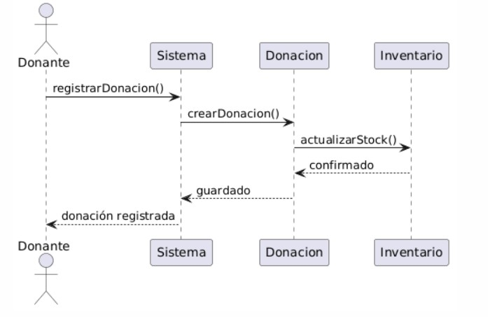
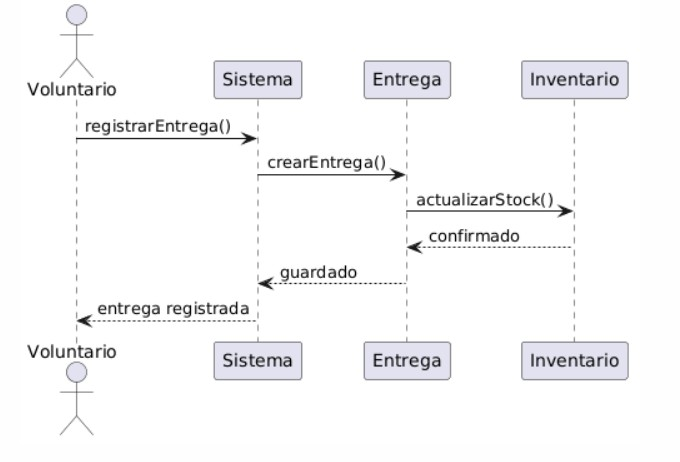
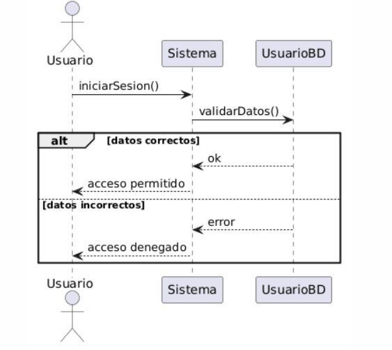

# Diagrama de secuencia

// Diagramas de Secuencia 
#		Caso de Uso	                    Actores involucrados
1		Registro de donación	        Donante → Sistema → Donación → Inventario

2		Registro de entrega	            Voluntario → Sistema → Entrega → Inventario

3		Autenticación de usuario	    Usuario → Sistema → Usuario (validación)

## 1.Registro de Donación

## 2.Registro de Entrega

## 3.Autenticacion de Usuario (con flujo alternativo)

