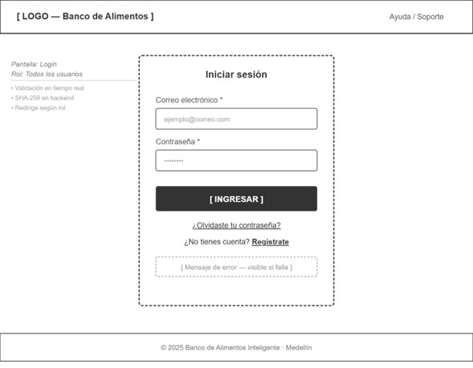
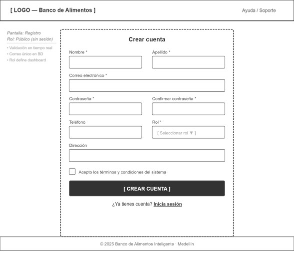
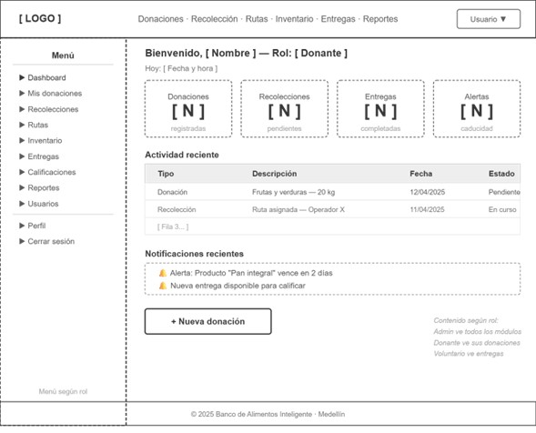
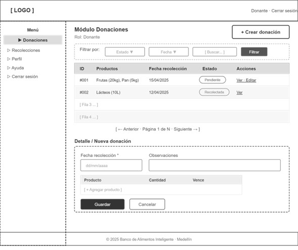
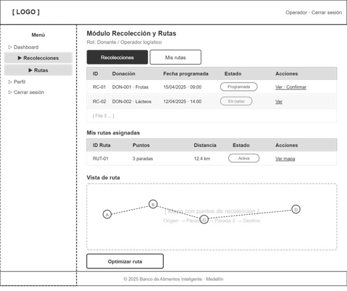
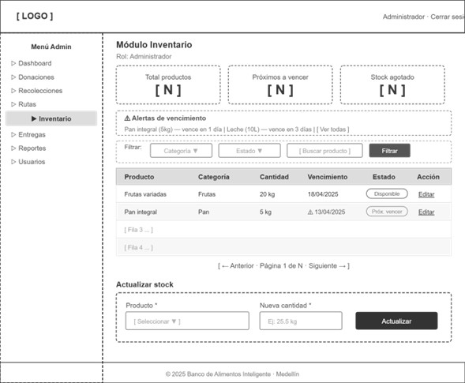
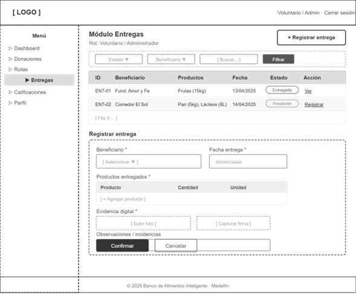
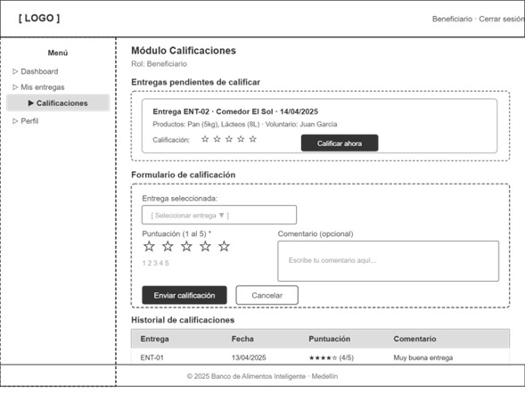
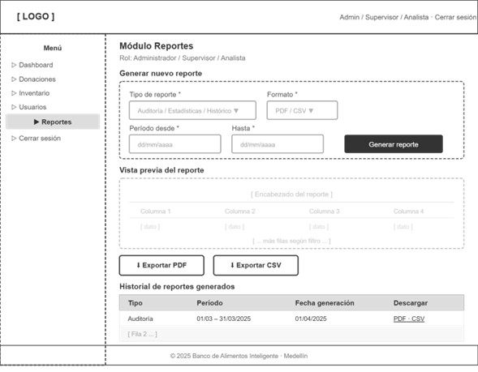
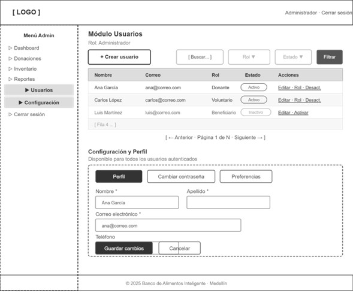

# Wireframes

## Pantalla 1 de 10 — Login

## Pantalla 2 de 10 — Registro de usuario

## Pantalla 3 de 10 — Dashboard (según rol)

## Pantalla 4 de 10 — Módulo Donaciones

## Pantalla 5 de 10 — Módulo Recolección y Rutas

## Pantalla 6 de 10 — Módulo Inventario

## Pantalla 7 de 10 — Módulo Entregas

## Pantalla 8 de 10 — Módulo Calificaciones

## Pantalla 9 de 10 — Módulo Reportes

## Pantalla 10 de 10 — Módulo Usuarios y Configuración
